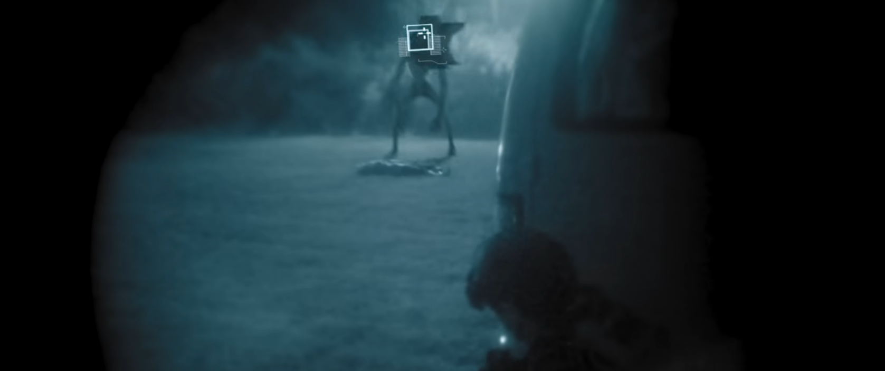
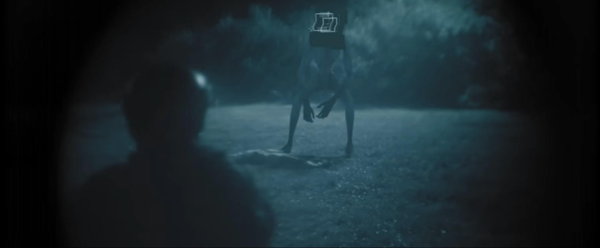
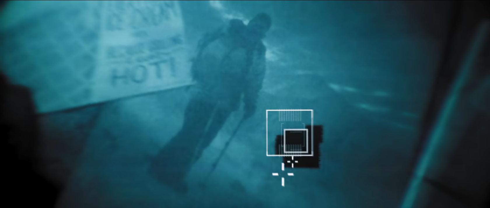

# Project SCRAMBLE - II

Project SCRAMBLE, an eyepiece assigned to ER and MTF-Tau-1, designed by Dr. Oleksei and Dr. Dan specifically to counteract the cognitohazard of SCP-096 in event of a containment breach. It carries a small microprocessor which constantly analyzes the viewing field for the facial features of SCP-096. Facial recognition software inside instantly identifies them, scrambling the image into an unrecognizable mess before the light reaches the human eye. As the MCU inside SCRAMBLE picks up SCP-096’s facial features and begin scrambling them, there is a split-second of uninterrupted light flow to the retina. Computers are fast, but not as fast as light. So, there is a split-second image of SCP-096’s direct face sent to the brain. It isn't even consciously received, but it is enough to trigger the hostile reaction in SCP-096. This flaw was discovered during Incident 096-1-A and Project SCRAMBLE was deemed to be ineffective.

SCRAMBLE - II negates this fatal flaw by utilizing the intelligence and research data obtained from Documentation #096-1 of Experiment 096-1. It has been confirmed that artistic depictions of SCP-096 will not trigger any hostile reaction. So instead of scrambling the face of SCP-096, SCRAMBLE - II deploys an edge preserving filter and turns the real time video feed into an artistic depictions, which in theory should allow visual observation of SCP-096b without triggering any hostile reaction. To confirm this, D class personnel and simulated containment breach is required.
